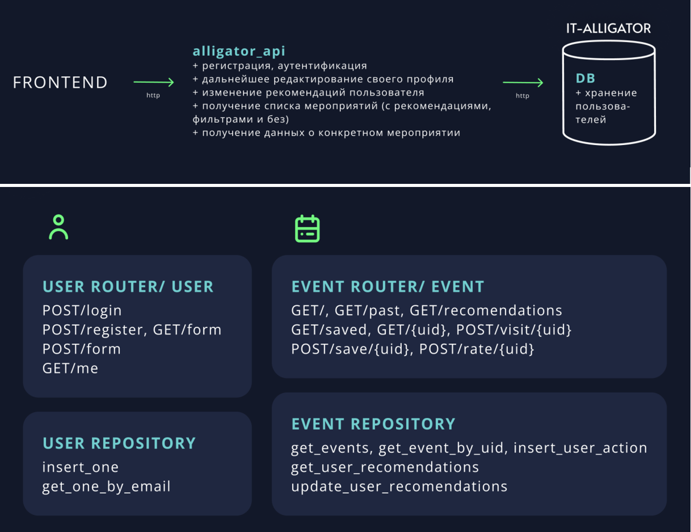
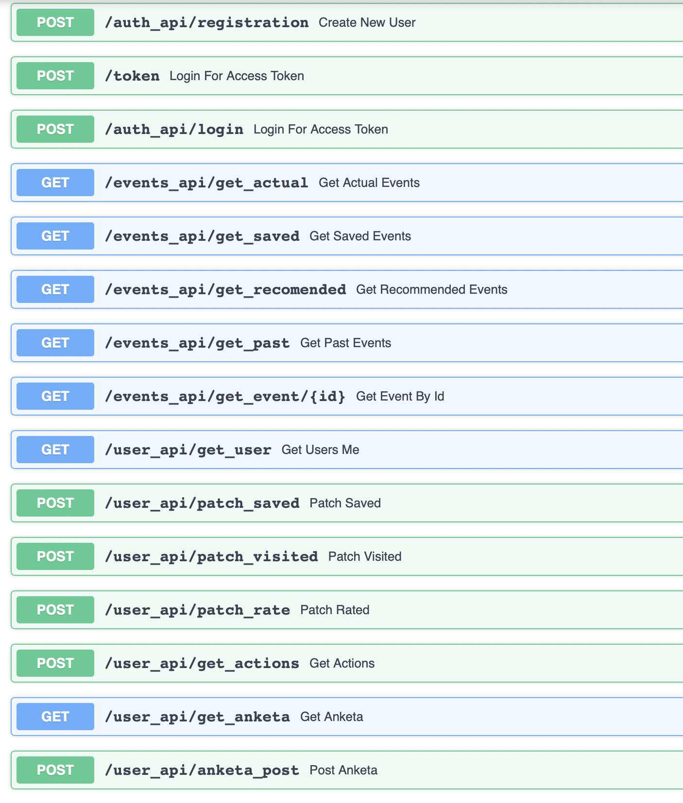
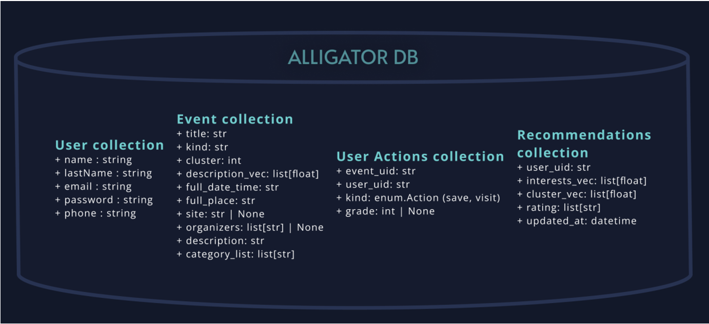

# Alligator backend

### Основное API.

## Схематическое представление архитектуры API

## Эндпоинты

## Схематическое представление базы данных

## Описание работы системы рекомендаций
Рекомендации устроены следующим образом:  

Каждое мероприятие из класса описывается n-мерным вектором(на данный момент 128мерным), а у каждого пользователя после прохождения анкетирования существует словарь, содержащий
- такой же n-мерный вектор 
- вектор-интересов для каждого класса мероприятий

Изначально, эти вектора интересов инициализируются
центроидами, средними векторами, и корректируются в зависимости от ответов, полученных в результате 
первичного анкетирования. Также мы проводим корректировку вектора интересов в зависимости от действий пользователя
на сайте(сохранение, посещение). 

Ранжирование проходит по вычисленной косинусной мере между вектором мероприятия 
и вектору интересов пользователя для соответствующего класса. 

В файлах `n_dim_operations.py` и `rec.py`
находится реализация всей векторной алгебры необходимой для данных вычислений.

## Запуск сервиса в Docker
1. Из frontend: `docker build -t alligator_client .`
2. Из event-loader: `docker build -t alligator_event-loader .`
3. Из alligator `docker-compose up`

locahost:8000/docs - документация API (Swagger UI)
## Сервис в сети
http://www.5.159.102.198
