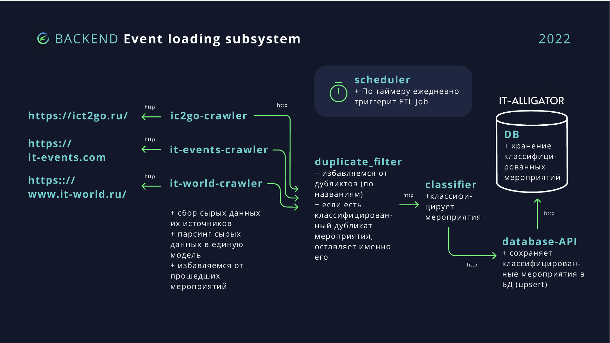

# Event loader

### _ETL-система для загрузки мероприятий со сторонних ресурсов, их дальнейшей обработки и сохранения в базу данных._

## Схематическое представление архитектуры системы

## Источники для парсинга мероприятий 
1. _https://ict2go.ru_
2. _https://it-events.com_
3. _https://www.it-world.ru_

## Описание работы ict2go, it-events, it-world crawlers
Три парсера. 

Выгружают мероприятия с соответствующих ресурсов, приводят мероприятия к единой модели описания:

- название
- формат
- время проведения
- расширенное время проведения
- список категорий
- место проведения
- сайт
- организаторы
- картинка мероприятия
- описание
- описательный вектор (вводится позже в компоненте classifier)
- кластер (вводится позже в компоненте classifier)

Результат в виде трех списков мероприятий передается в следующую компоненту ETL-системы "duplicate filter".

## Описание работы duplicate filter
Компонент системы, принимающий списки мероприятий и удаляющий дубликаты по названиям.

Если встречается одно и то же мероприятие, то по возможности берется объект из ict2go, вторым по приоритету источником сохранения является it-events.

Результат передается в виде списка в компоненту "classifier".

## Описание работы classifier
Компонента для классификации мероприятий.

- В файле `init_classification.py` реализованы все необходимые функции и инициализации моделей
для подготовки данных для рекомендательной системы. А именно:
  - пред обработка текстовых данных
  - инициализация модели для векторизации текстов
  - инициализация модели для классификации
  - последующее применение этих моделей

- В файле `classification.py`  происходит непосредственный вызов необходимых функций из init_classification
- В папке ds_models лежат необходимые для инициализации моделей файлы,
также там находится файл со списком стоп-слов, необходимые для пред обработки текстовых данных.

## Описание работы database api
Компонента для сохранения мероприятий в базу данных. 

При первом подключении к базе данных, создается база с названием "alligator_database" и коллекцией "events_collection". В дальнейшем, подключение происходит к уже существующей коллекции.

Мероприятия добавляются по принципу UPSERT в упорядоченном по дате проведения виде. Информация об уже сохраненных мероприятиях обновляется, а новые сохраняются в базе данных.

## Описание работы scheduler
Основная компонента ETL-системы. По таймеру ежедневно в 23:59 запускает "ETL-job" (работу системы).

## Работа в Docker
Создание образа: `docker build -t alligator_event-loader .`

Далее `docker-compose up` из alligator

## Прямой запуск ETL
 `python3 event_loader/scheduler.py`
